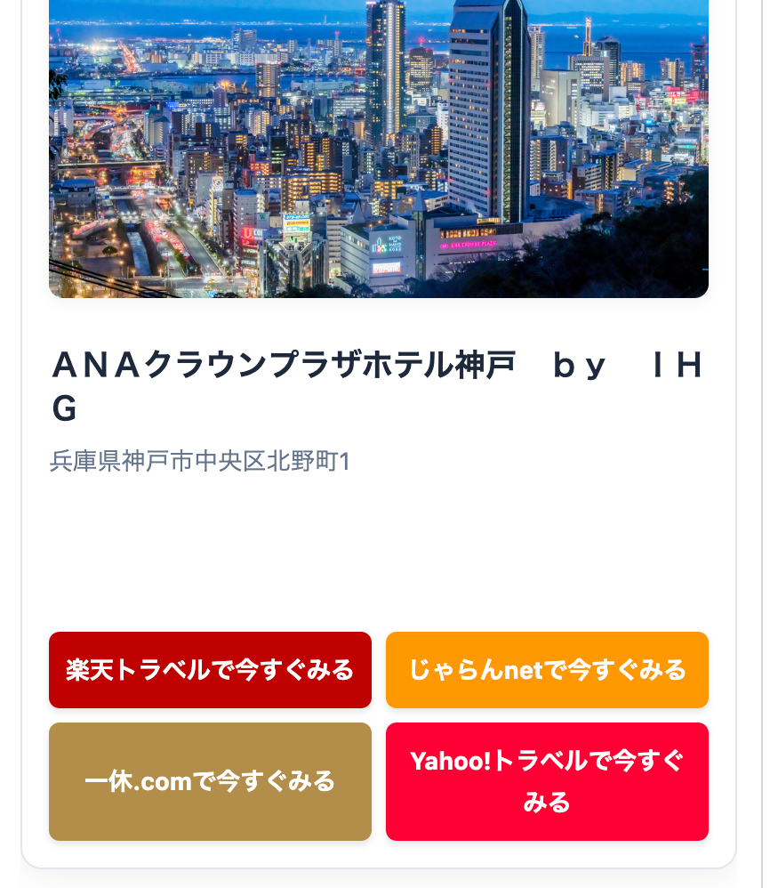

<p align="center">
  
</p>

# 🏨 Travel Link Builder (v3.0)

[](https://github.com/nry0ta/link-builder/actions/workflows/deploy.yml)

旅行・宿泊ブログ向けのアフィリエイトリンク一括生成ツールです。
楽天トラベル、じゃらん、一休、Yahoo!トラベルなどの主要サイトのボタンを、洗練されたデザインで簡単に作成できます。

### 🚀 Live Demo
**[builder.nrtlog.com](https://builder.nrtlog.com)**

---

## ✨ Features

- **主要サイト一括検索**: 楽天トラベルAPIを利用して、国内ホテルをキーワード検索。
- **自動ボタン生成**: 選択したホテルの情報を元に、アフィリエイトボタン付きのカードを生成。
- **任意サイト対応**: 標準のサイト以外にも、自由なラベルとURLでカスタムボタンを追加可能。
- **海外ホテル・アクティビティ対応**: 準備中ながら、手動でのリンク作成機能を完備。
- **レスポンシブデザイン**: PCでもスマホでも綺麗に表示される、ブログに馴染むデザイン。
- **TypeScript & React**: 最新のReact 19とTypeScriptで構築された堅牢なアーキテクチャ。

---

## 📸 Screenshots



---

## 🛠 Usage

1. **検索**: トップページでホテル名を検索します。
2. **選択**: 該当するホテルを選んでください。
3. **設定**: 生成されたリンクのカスタマイズ（画像URLの変更、住所の有無、ボタンの追加）を行います。
4. **コピー**: 生成されたHTMLコードをコピーして、ブログのカスタムHTMLブロック等に貼り付けます。

---

## 💻 Development

### Setup
```bash
npm install
```

### Dev Server
```bash
npm run dev
```

### Build
```bash
npm run build
```

---

## 📄 License
MIT License. Created by [nry0ta](https://github.com/nry0ta).
